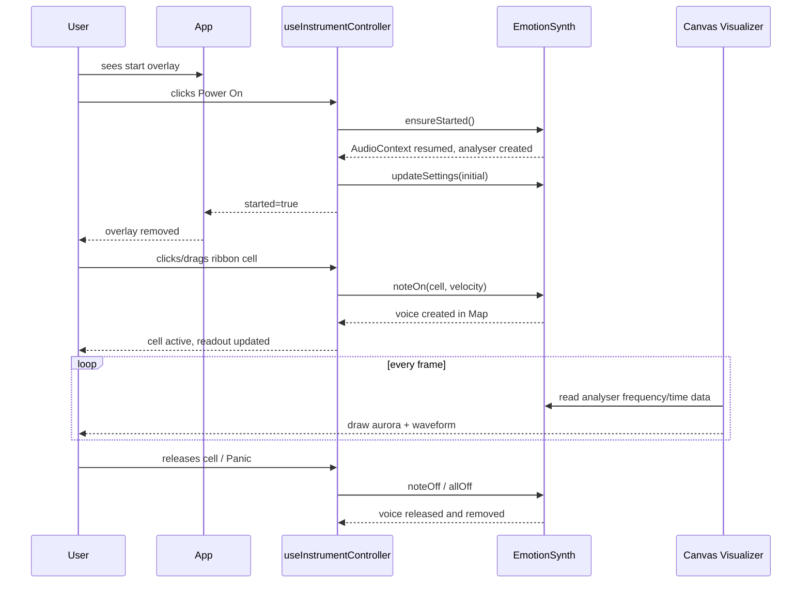
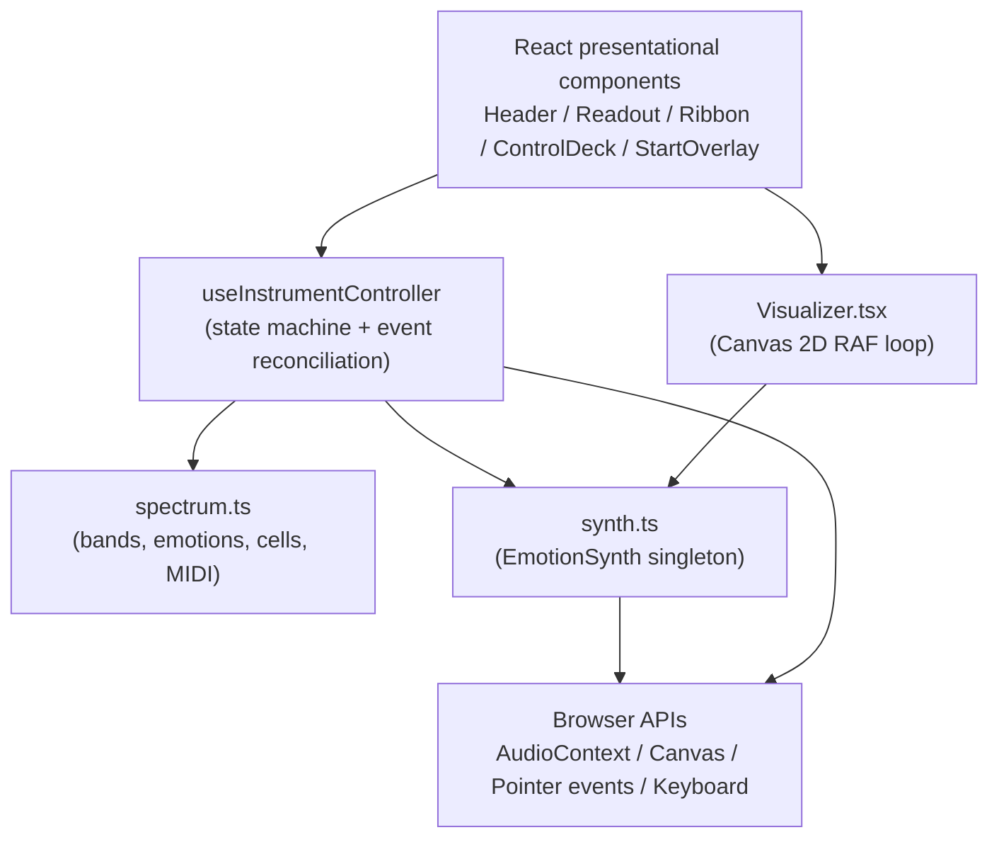
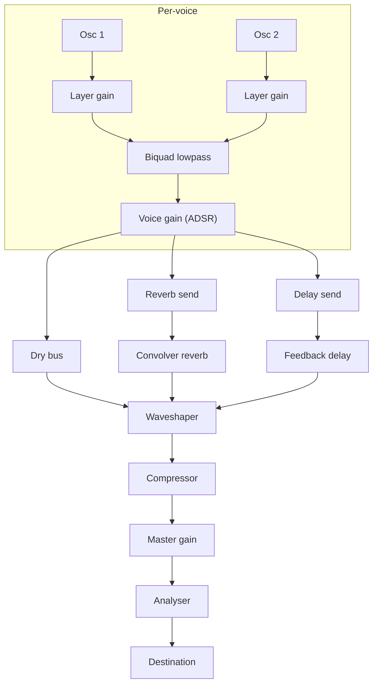
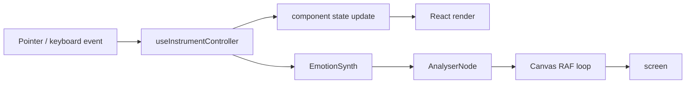
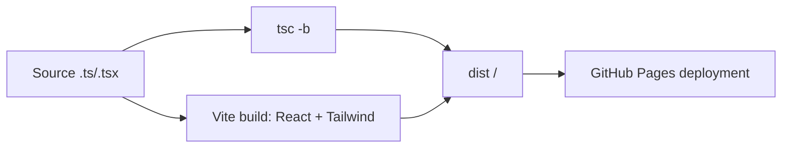

# Architecture

This document is the system-level explanation of the Emotion Spectrum. It is for a developer who wants to understand the whole system before reading source code, or an evaluator who wants to verify how the technical system produces the artwork.

**Read order:** [README.md](README.md) → this document → [docs/technical](docs/technical) → source.

## Overview

The app is a small single-page instrument written in React + TypeScript and bundled by Vite. It has one non-trivial audio engine and one non-trivial visualiser. Everything else is state plumbing and interface presentation.

The central design rule is:

> React owns the controller. The synth owns the audio. The canvas owns the image.

This is not an MVC pattern in the traditional sense. It is closer to an *offboarded performance graph*: user gestures update React state, React state calls into a singleton audio engine, and the audio engine's analyser node continuously exposes signal data to a canvas that is deliberately outside React's render lifecycle.

## Application lifecycle

## Modules

### `src/lib/spectrum.ts` — the conceptual data model

This is the only place where the project's core metaphor is encoded as data.

- `Band` describes one electromagnetic region: human-readable wavelength/frequency labels, a colour, a glow, a timbre, a base MIDI note, and five emotions.
- `Emotion` is `{ name, semitone }`. Semitone is relative to the band's base note.
- `Cell` is the flattened result: one playable combination of band + emotion + MIDI number + frequency + global index.
- `CELLS` is built once at module evaluation by iterating bands in order. Its order is the visual and tonal order of the instrument.

The palette is a major-pentatonic subset `[0, 2, 4, 7, 9, 12]`, so any combination of latched notes is harmonic. This is a functional decision, not an aesthetic accident: the drone and arpeggiator would be less listenable if chromatic intervals were allowed.

### `src/lib/synth.ts` — the audio engine

`EmotionSynth` is a singleton class, created and exported as `synth`. It is not a React component and does not receive props. It is called imperatively.

Responsibilities:

- Create and resume the `AudioContext`.
- Build the master chain: per-voice gain → dry bus → waveshaper → compressor → master gain → analyser → destination.
- Generate a convolution impulse response once at start.
- Build a feedback delay bus with a lowpass filter.
- Create, release, and forget voices.
- Expose `analyser` for the visualiser.

### `src/hooks/useInstrumentController.ts` — the state machine

This hook is the only owner of instrument state outside the synth.

State owned here:

- `started` — audio gate status.
- `mode` — `"ribbon" | "theremin"`.
- `drone`, `arp`, `arpRate`.
- `settings` — `SynthSettings`.
- `latched` — Set of cell keys held by drone.
- `activeKeys` — Set of cell keys currently visually active.
- `currentCell` — last touched cell for the readout.
- `keyStart` — keyboard window offset into `CELLS`.

Refs:

- `soundingRef` — Set of cells that are currently sounding in the synth.
- `latchedRef` — synchronous mirror of `latched` because the arpeggiator's `setInterval` callback must read the current latch set without subscribing to React state.
- `pointerDown`, `pointerCellKey` — pointer gesture state.

## State architecture

The hook is deliberately not a global store. It is a local controller that is instantiated once by `App`. The reason is simple: the project is a single screen and the state is small.

The most important distinction is the one between **React state** and **audio state**.

| Concept | React state | Synth state |
| --- | --- | --- |
| Note is sounding | `soundingRef` (side-effect mirror) | `voices: Map<string, Voice>` |
| Drone latched | `latched` | voices created in `noteOn` |
| Active visual highlight | `activeKeys` | not represented |
| Current readout | `currentCell` | not represented |
| `drone` setting | React `drone` | `synth.settings.drone` |

Why the duplication exists:

1. React requires declarative state to render the active cells, readout, and toggles.
2. The synth cannot afford to run React updates per audio tick; it manages its own voice `Map`.
3. The two are reconciled by `useInstrumentController`'s callbacks and effects.

### Reconciliations

There are two notable reconciliation effects.

1. **Drone latch reconciliation.** When `drone` is on and `arp` is off and mode is ribbon, the hook calls `noteOn` for every latched key that is not already sounding, and `noteOff` for every sounding key that is no longer latched.

2. **Arpeggiator silence.** When `arp` turns on, the hook first silences all sustained voices. The arpeggiator then plucks latched cells on a timer instead of holding them.

Mode switching and Panic both call `synth.allOff()` and clear all controller state. This is a hard reset, not a smooth crossfade.

## Rendering architecture

The rendered canvas is not a React re-render target.

`Visualizer.tsx` mounts a `<canvas>`, sets a `requestAnimationFrame` loop, and reads `synth.analyser.getByteFrequencyData()` and `getByteTimeDomainData()` every frame.

The canvas draws two layers:

1. A mirrored **frequency aurora** — 96 bars, each mirrored around the horizontal centre.
2. An **oscilloscope waveform** — a line across the full time-domain buffer, with a faint secondary echo line.

There is no particle system, no shader, and no WebGL. This is intentional: it keeps the visualiser simple to port, predictable in performance, and legible against the interface's terminal-like background.

### Prop flow

`App` computes `accent` and `intensity` from `currentCell`. These are passed into `Readout → Visualizer`. The visualiser keeps them in refs so the RAF loop never needs to re-subscribe. This is the only per-frame dependency from React to the canvas.

## Audio architecture

### Voice graph

### Why this graph

- **Per-band timbre** is implemented as oscillator count, detune spread, lowpass cutoff, Q, attack, release, and space amount.
- **Space** controls both reverb and delay sends simultaneously, with delay send scaled at `0.7 × space`. This means one band parameter produces a coherent ambience, not two unrelated effects.
- **Waveshaper** is a tanh-like curve generated at runtime. `drive` changes the curve directly. `oversample` is `"4x"`.
- **Analyser** is last in the chain, before destination, so it measures post-effects audio.

### Why it is a singleton

Only one instrument is ever mounted. A singleton avoids:

- accidental duplicate `AudioContext`s from React StrictMode double-render,
- a second context being created if a component remounts,
- and the visualiser needing a prop callback to find the audio engine.

This is a simple, pragmatic choice for a performance instrument. It would not scale to a multi-instance patch system.

## Data flow

## Event flow

1. Pointer down / key down reaches `useInstrumentController`.
2. The controller resolves the event into a `Cell`.
3. In ribbon mode, it calls `soundOn` / `soundOff`; in drone mode it calls `toggleLatch`; in theremin mode it calls `thereminOn` / `thereminGlide`.
4. The synth creates a voice or retunes it.
5. The same handler updates `currentCell` and `activeKeys`, causing a React render.
6. The canvas independently reads the analyser next frame.

Pointer moves are throttled only by the browser's native pointer-event rate. There is no explicit rAF throttle on pointer handling; the synth uses `setTargetAtTime` for glides so audio does not click.

## External dependencies

Runtime dependencies are intentionally small:

- `react`, `react-dom`
- `tailwindcss`, `@tailwindcss/vite`
- `lucide-react`

`framer-motion` and `react-router-dom` were present in the initial template but unused; they have been removed.

Dev dependencies are task-specific:

- `vite`, `typescript`, `eslint`, `typescript-eslint`
- `vitest` for unit tests
- `@playwright/test` for browser smoke tests and screenshot capture
- `@types/node`, `@types/react`, `@types/react-dom`

## Browser APIs used

- `AudioContext` / `webkitAudioContext`
- `OscillatorNode`, `GainNode`, `BiquadFilterNode`
- `ConvolverNode`, `DelayNode`, `WaveShaperNode`, `DynamicsCompressorNode`
- `AnalyserNode`
- `CanvasRenderingContext2D`
- `PointerEvent`, `KeyboardEvent`
- `requestAnimationFrame`, `setInterval`
- `DevicePixelRatio` for canvas scaling

## Build pipeline

The Vite config uses `base: "./"`. Combined with the GitHub Pages Actions workflow, the same `dist/` works under `github.io/<repo>/` without a hard-coded origin.

## Performance model

- **Canvas:** one RAF loop, `Uint8Array` buffers allocated once, DPR capped at 2.
- **Synth:** one voice per cell key. Voices are not pooled; each `noteOn` builds fresh oscillator nodes. Release scheduling uses `exponentialRampToValueAtTime` and the oscillator stop time is release + 50ms.
- **Convolver:** impulse generated once at startup; sample length is `sampleRate × 3.2s`, which is the largest allocation in the audio path.
- **React:** renders only on observable state change. `currentCell`, `activeKeys`, and `latched` change frequently during performance but the component tree is forty-ish buttons, so this is not a problem.
- **Fonts:** Google Fonts loaded via CSS `@import`; no `font-display: swap` is set, so there is a possible text flash on first load.

## Major design decisions

### 1. Data-driven instrument instead of hard-coded notes

Every band and emotion lives in `spectrum.ts`. Adding a band is a data change, not a component change.

### 2. Two oscillators per voice, not a full sampler

The instrument is about timbral character, not sample fidelity. Two to three oscillators, detuned relative to the band's `detune` value, communicate the spectral metaphor.

### 3. Pentatonic consonance as a boundary condition

All cell semitones come from a major-pentatonic set. The arpeggiator and drone are therefore guaranteed to be consonant regardless of which cells are latched. This is the project's one concession to comfort. It is also one of its strongest constraints.

### 4. Monophonic theremin

The theremin mode is a single continuous voice. It is conceptually a different instrument from the ribbon, not merely a "smooth ribbon". Keeping it monophonic avoids the ambiguity of what happens to the previous voice when you slide to a new band.

### 5. No randomisation

There is no procedural randomness in the sound or the visual state. The instrument is deterministic given the user's choices. This keeps the drone/arp system legible and makes the work closer to an instrument than a generative artwork. Randomness is listed as an experimental direction in the roadmap, not a hidden feature.

## Technical compromises

- The 60-cell ribbon is not virtualised. At this size it is fine; if the project grows to hundreds of cells (e.g. one cell per electron energy level), the button map should become a canvas render or virtual list.
- The synthesizer is not sample-accurate under load. `setTargetAtTime` is used for glides and filter smoothing; the voice attack uses `exponentialRampToValueAtTime`. On a very busy drone with many voices, this is acceptable but not studio-grade.
- The reverb is a generated noise impulse, not an convolution of a real space. It is designed to *feel* like reverb rather than to emulate a location.
- There is no test coverage for the audio engine, because `AudioContext` is not available in the pure Node test environment. The visualiser and synth are verified manually and through browser smoke tests.

## Limitations

- Audio cannot start without a user gesture (browser autoplay policy).
- Drone-off does not immediately release already-sounding latched voices.
- There is no persistence, no presets, no MIDI/OSC, and no offline rendering.
- There is no touch-optimised access to the keyboard row beyond the ribbons themselves.
- The interface assumes a landscape-ish desktop layout; it degrades on mobile but is not a mobile-first experience.

## Subsystem documentation

- [docs/technical/audio-engine.md](docs/technical/audio-engine.md)
- [docs/technical/rendering-system.md](docs/technical/rendering-system.md)
- [docs/technical/state-model.md](docs/technical/state-model.md)
- [docs/technical/data-flow.md](docs/technical/data-flow.md)
- [docs/technical/performance.md](docs/technical/performance.md)
- [docs/design/interface-system.md](docs/design/interface-system.md)
- [docs/design/visual-language.md](docs/design/visual-language.md)
- [docs/design/interaction-model.md](docs/design/interaction-model.md)
- [docs/development/setup.md](docs/development/setup.md)
- [docs/development/debugging.md](docs/development/debugging.md)
- [docs/development/deployment.md](docs/development/deployment.md)
