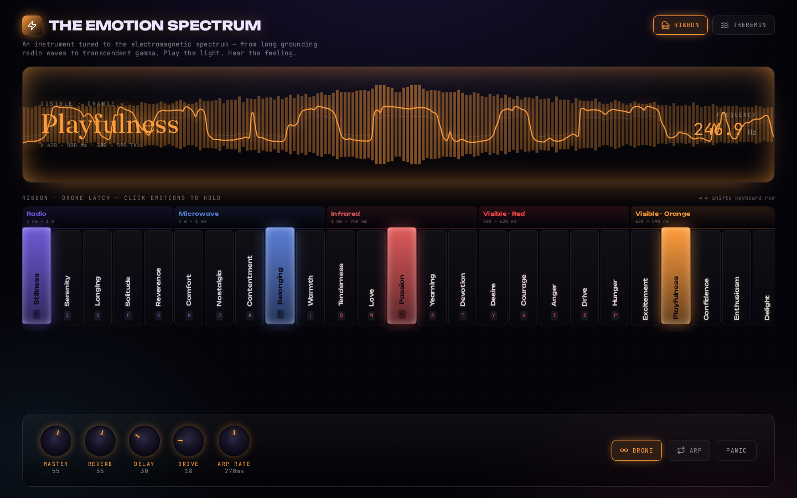

# The Emotion Spectrum

A browser instrument in which twelve bands of the electromagnetic spectrum are treated as twelve emotional regions. Each band owns a timbre, a colour, and a family of emotions; the whole spectrum is a playable ribbon that runs from long grounding radio waves to short, transcendent gamma.

**Created by Zazie Productions**

> Click the interface below to launch the live project.

[](https://zazieproductions.github.io/Electromagnetic-Spectrum-Emotion-Web-Instrument/)

[](https://zazieproductions.github.io/Electromagnetic-Spectrum-Emotion-Web-Instrument/)

---

**Status:** working prototype · single-page instrument · deployable
**Runtime:** React 19 + TypeScript + Vite + Web Audio API + Canvas 2D
**Input:** pointer / touch, QWERTY keyboard, vertical-drag knobs

> ⚠️ **Audio warning:** this instrument starts silent and only produces sound after a click or key-press (browser autoplay policy). Start at a low Master level. Sustained voices, the drone latch, the arpeggiator, and the theremin mode can hold notes for several seconds.

## Overview

The Emotion Spectrum is not a general-purpose synthesizer. It is a single, deliberately bounded instrument built around one rhetorical move: *the electromagnetic spectrum is enormous, invisible, and already continuous — so is emotional life.*

Radio waves are not "grounding" and gamma rays are not "transcendent" in any physical sense. The mapping is poetic and unapologetically artificial. The technical system enforces that fiction through a strict, legible coupling between each band's data and its audio behaviour.

## Why this exists

This project began as a question about how an interface can make a *scientific* continuum feel intimate. The electromagnetic spectrum is a real, quantitative ordering of energy, but it is also culturally associated with suspicion (radiation), wonder (stars), and myth (auroras). The Emotion Spectrum takes that rational backbone and gives it a playable emotional body.

It is also an instrument project: not a data visualisation with sound attached, but something closer to a cybernetic chime rack. The majority of the implementation is the audio engine and the state model that mediates between physical play and sustained synthesis.

## Live demo

The production build is deployed to GitHub Pages from the `main` branch (and can be deployed from any branch using the `Deploy GitHub Pages` action).

- **Deployed site:** <https://zazieproductions.github.io/Electromagnetic-Spectrum-Emotion-Web-Instrument/>
- **Deployment workflow:** [`.github/workflows/deploy-pages.yml`](.github/workflows/deploy-pages.yml)

## Features

- **Twelve electromagnetic bands**, from Radio to Gamma, each with five emotional states.
- **Playable ribbon:** press or drag across the spectrum to trigger notes; scroll horizontally to reach higher bands.
- **Two performance modes:**
  - **Ribbon** — discrete, velocity-fixed notes with a scalar keyboard row.
  - **Theremin** — one continuous voice that glides across the whole ribbon with configurable portamento.
- **Drone latch:** click emotions in ribbon mode to hold them as sustained voices.
- **Arpeggiator:** sequence latched notes with a rate knob (approx. 90–450 ms per step).
- **Per-band timbre:** each band defines oscillator stack, detune, lowpass cutoff, resonance, space send, attack, and release.
- **Lab control deck:** Master, Reverb, Delay, Drive, plus Glide (Theremin) or Arp Rate (Ribbon).
- **Realtime audiovisualiser:** analyser data drawn as a mirrored frequency aurora and oscilloscope waveform on Canvas 2D.
- **Panic button:** immediately silences all voices.

## Interaction / Controls

| Input | Ribbon mode | Theremin mode |
| --- | --- | --- |
| Pointer press on a cell | Sound on (or latch if Drone is on) | Start the continuous theremin voice |
| Pointer drag | Slide between cells | Sweep the frequency spectrum |
| Pointer release | Sound off | Voice off |
| `A–L` / `Q–P` | Home-row keyboard over the current window | Pluck a note |
| `◄ ►` / `ArrowLeft` / `ArrowRight` | Shift the keyboard window by 5 cells | Same |
| Knobs | Drag vertically to change a value; double-click to reset to 50% | Same |

The keyboard row is not fixed to the whole spectrum. It covers twenty cells at a time, and `◄ ►` moves the window.

## Technical architecture

The application separates cleanly into three layers:

1. **Data model** (`src/lib/spectrum.ts`) — the band/emotion/note graph and the flattened `CELLS` ribbon.
2. **Audio engine** (`src/lib/synth.ts`) — a singleton `EmotionSynth` that owns the `AudioContext`, master chain, effect buses, and voice map.
3. **Instrument state machine** (`src/hooks/useInstrumentController.ts`) — React state for started/drone/arp/mode/settings/active voices and pointer/keyboard reconciliation with the synth.

The React layer is deliberately thin. It renders the interface and translates user gestures into calls on the synth. The synth does the real-time work.

```text
pointer / keyboard
        │
        ▼
useInstrumentController  ──►  EmotionSynth
        │                          │
        ▼                          ▼
React components           AudioContext graph
        │                          │
        ▼                          ▼
Canvas visualizer  ◄────  AnalyserNode
```

See [ARCHITECTURE.md](ARCHITECTURE.md) for the full system design and audio signal path.

## Project structure

```text
.
├── .github/
│   ├── ISSUE_TEMPLATE/
│   ├── workflows/
│   │   ├── ci.yml
│   │   ├── capture-screenshots.yml
│   │   └── deploy-pages.yml
│   └── pull_request_template.md
├── docs/
│   ├── architecture/
│   ├── design/
│   ├── development/
│   ├── images/
│   └── technical/
├── public/
│   └── favicon.svg
├── scripts/
│   └── capture-screenshots.mjs
├── src/
│   ├── components/
│   │   ├── Background.tsx
│   │   ├── ControlDeck.tsx
│   │   ├── Header.tsx
│   │   ├── Knob.tsx
│   │   ├── Readout.tsx
│   │   ├── Ribbon.tsx
│   │   ├── StartOverlay.tsx
│   │   └── Visualizer.tsx
│   ├── hooks/
│   │   └── useInstrumentController.ts
│   ├── lib/
│   │   ├── spectrum.ts
│   │   └── synth.ts
│   ├── App.css
│   ├── App.tsx
│   ├── index.css
│   └── main.tsx
├── tests/
│   ├── e2e/
│   └── unit/
├── ARCHITECTURE.md
├── CHANGELOG.md
├── CONTRIBUTING.md
├── README.md
├── ROADMAP.md
└── SECURITY.md
```

## Installation

The runtime requires Node.js 20+ and a browser with Web Audio API.

```bash
git clone https://github.com/zazieproductions/Electromagnetic-Spectrum-Emotion-Web-Instrument.git
cd Electromagnetic-Spectrum-Emotion-Web-Instrument
npm ci
```

### Local development

```bash
npm run dev
```

Vite serves the app at `http://localhost:5173`. The host is bound per the platform preview policy as `0.0.0.0` when running the `preview` command.

### Production build

```bash
npm run build
npm run preview
```

The build script runs the TypeScript project build (`tsc -b`) and then Vite. The output is written to `dist/`.

### Tests

```bash
npm run typecheck   # TypeScript project build
npm run lint        # ESLint
npm test            # Vitest unit tests against the spectrum data model
npm run test:e2e    # Playwright Chromium smoke tests (requires a browser install)
```

### Screenshots

```bash
npm run capture:screenshots
```

This script boots the dev server, drives the real application through Power On, drone latch, theremin glide, and arpeggiator states, then writes the project screenshots and GitHub social preview into `docs/images/`.

## Deployment

The production bundle is deployed through the GitHub Pages Actions workflow:

```bash
# push to main
git push origin main

# or deploy the current branch manually
gh workflow run deploy-pages.yml --ref <branch>
```

The workflow reads no environment variables and uses a relative Vite base, so the same `dist/` directory works locally and under the repository sub-path.

## Screenshots

| Image | State |
| --- | --- |
| [`docs/images/project-preview.png`](docs/images/project-preview.png) | Ribbon mode, Drone latch, sustained voices |
| [`docs/images/project-active.png`](docs/images/project-active.png) | Theremin mode, mid-sweep |
| [`docs/images/project-detail.png`](docs/images/project-detail.png) | Arpeggiator mode, full interface |

## Design system

The interface is styled as a hybrid between a scientific instrument and a recovered terminal.

- **Display type:** Unbounded (weights 400/600/800) for band names, headers, and emotion labels.
- **Mono type:** JetBrains Mono for readouts, labels, control names, and telemetry.
- **Serif type:** Fraunces for the large emotion readout.
- **Background:** near-black `#05040a` with layered radial glows and a slowly drifting grain grid.
- **Band colours:** one primary accent per electromagnetic band; the active-emotion accent propagates through the header, visualizer, ribbon, and knobs.
- **Controls:** vertical-drag rotary knobs with `-135° → 135°` indicator arcs; `Drone` and `Arp` are toggle buttons; `Panic` is a low-emphasis utility.
- **Motion:** short `75ms` cell translate/scale on active notes; knob values have no animation (they are expected to behave like hardware).

See [docs/design/visual-language.md](docs/design/visual-language.md) for the full visual and interaction rationale.

## Concept / artistic context

The piece operates in the gap between scientific naming and emotional naming. The spectrum is treated as a fixed, ordered system that the player navigates left-to-right, but the emotional associations are subjective and deliberately inconsistent: green is both calm and envy; ultraviolet is both anxiety and anticipation.

The instrument's "personality" is not ironic. It is earnest about the fiction. The synth voices get brighter and more aggressive as the spectral energy increases, and the visualizer follows the active band's colour, so the conceptual ascent *is* the audio ascent. There is no randomisation layer and no persistence: each session is a single, unrecoverable performance. This is a deliberate constraint, not an unfinished feature.

## Performance considerations

- The visualizer runs on a single `requestAnimationFrame` loop and reads analyser buffers directly.
- All oscillators are created per note and stopped after release; voices are tracked in a `Map<string, Voice>` keyed by cell id.
- The ribbon uses ordinary DOM buttons, not a virtualised list. At 60 cells this is not a bottleneck.
- The reverb impulse response is generated once at audio-context start.
- Device pixel ratio is capped at 2 for the canvas.

## Browser support

The instrument targets the current evergreen browser generation:

- Chrome / Edge 90+
- Safari 15+ (AudioContext, Pointer Events, Canvas)
- Firefox 88+

It will not run offline in the strictest sense because the web fonts load from Google Fonts; the application itself has no offline service worker.

## Accessibility

- The ribbon cells are `<button>` elements, so they are keyboard focusable in principle.
- The primary keyboard interaction path is home-row mapping rather than tabbing, which is the instrument's intended control model.
- Two gestures (pointer drag and vertical-drag knobs) currently lack explicit keyboard equivalents. This is a documented limitation.
- Colour is not the only state indicator: active voices are also displaced vertically and annotated with the keyboard key.

## Known limitations

- **Drone-off behaviour:** turning Drone off while latched voices are sounding does not immediately release the latched voices; use Panic or switch modes to silence a held pad. This is being treated as a known interaction debt.
- **No persistence:** presets, latched sets, and settings are lost on reload.
- **No MIDI / OSC / WebMIDI input yet.**
- **No downloadable audio output.** The Web Audio graph is not routed to an offline renderer or MediaRecorder.
- **Theremin is monophonic.**
- **Knob drag is vertical-only** and does not support fine control modifiers.
- **No visualiser recording / snapshot export.**

## Testing

- `tests/unit` covers the spectrum data model and MIDI mapping.
- `tests/e2e` covers the boot path: interface chrome renders, Power On gesture clears the audio gate.
- CI runs typecheck, lint, unit tests, production build, and Chromium smoke tests.

## Roadmap

See [ROADMAP.md](ROADMAP.md) for near-term, experimental, and research directions.

## Contributing

See [CONTRIBUTING.md](CONTRIBUTING.md) for the contributor workflow and documentation conventions.

## License

No explicit license has been distributed with this repository yet. Rights to the work remain with Zazie Productions until a license is added. If you want to use or exhibit the project, open an issue first.

## Credits

- **Concept, code, and design:** Zazie Productions
- **Open-source foundations:** React, Vite, TypeScript, Tailwind CSS, Lucide, Playwright, Vitest, and the browser platform's Web Audio and Canvas APIs.
