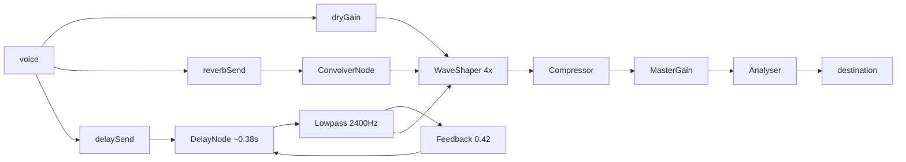

# Audio Engine

Source: [`src/lib/synth.ts`](../../src/lib/synth.ts)

The audio engine is a singleton `EmotionSynth` exported as `synth`. It is not a React component. It is constructed at module load, but the `AudioContext` is only created when `ensureStarted()` is called, and only after a user gesture.

## Context creation

`ensureStarted()` checks for an existing started context and resumes it if the browser suspended it. It otherwise creates:

```ts
const Ctor =
  window.AudioContext ||
  (window as ...).webkitAudioContext;
const ctx = new Ctor();
```

The `webkitAudioContext` fallback exists for older Safari WebKit builds.

## Master chain

The master chain is always the same:

```text
per-voice gain -> dry bus -> Waveshaper -> DynamicsCompressor -> MasterGain -> AnalyserNode -> destination
```

Reverb and delay buses are parallel sends that return into the dry bus *before* the waveshaper. Therefore drive also affects the wet signal, which is intentional: the effect is treated as part of the instrument, not a post-process.



### Waveshaper

The shaper is a tanh-like curve generated from the Drive control:

```text
x in [-1, 1]
k = amount * 100
curve[i] = ((1 + k) * x) / (1 + k * abs(x))
```

Changing `synth.settings.drive` immediately regenerates the curve. It is set to `oversample = "4x"`.

### Compressor

The compressor is a safety net rather than a creative stage. Parameters: threshold `-18 dB`, knee `24`, ratio `3.5`, attack `6 ms`, release `250 ms`.

## Voice construction

Each voice is:

```text
stack of oscillators (band.waves)
  -> per-layer gain (1 / layers)
  -> BiquadFilter lowpass (band.cutoff, band.q)
  -> voice gain
  -> dry + band-space-scaled sends
```

The oscillator frequency is set from the `Cell.freq`. Detune is spread symmetrically:

```text
spread = (i / (layers - 1) - 0.5) * 2
detune = spread * band.timbre.detune
```

For two layers this produces `[-detune, +detune]`. For three it produces `[-detune, 0, +detune]`.

## Note envelope

`noteOn(cell, velocity)`:

1. Builds the voice.
2. Starts all oscillators at `now`.
3. Cancels existing gain automation.
4. Ramps gain to `peak` over `attack`.
5. If not in drone mode, follows the attack with a `setTargetAtTime(peak * 0.75, ..., 0.4)` plateau.
6. Ramps the lowpass from `cutoff * 0.6` to `cutoff` over `attack + 150ms`.

`noteOff` calls `releaseVoice`, which cancels automation, reads the current gain, ramps exponentially to `0.0001` over `release`, and stops oscillators at `release + 50ms`.

## Band as timbre

| Band | Wave stack | Detune | Cutoff | Q | Space | Attack | Release |
| --- | --- | --- | ---: | ---: | ---: | ---: | ---: |
| Radio | sine, triangle | 6 | 520 | 0.7 | 0.85 | 0.50 | 2.6 |
| Microwave | triangle, sine | 8 | 760 | 0.8 | 0.70 | 0.35 | 2.0 |
| Infrared | triangle, sawtooth | 10 | 1100 | 1.0 | 0.55 | 0.18 | 1.6 |
| Red | sawtooth, square | 12 | 1500 | 1.3 | 0.40 | 0.05 | 1.1 |
| Orange | sawtooth, triangle | 9 | 1900 | 1.1 | 0.42 | 0.04 | 1.0 |
| Yellow | square, triangle | 7 | 2400 | 1.0 | 0.40 | 0.03 | 0.9 |
| Green | triangle, sine | 6 | 2600 | 0.9 | 0.50 | 0.06 | 1.1 |
| Blue | sine, triangle | 8 | 2200 | 1.1 | 0.62 | 0.12 | 1.6 |
| Violet | sawtooth, sine | 11 | 2800 | 1.4 | 0.66 | 0.10 | 1.5 |
| Ultraviolet | sawtooth, square | 14 | 3400 | 1.8 | 0.50 | 0.02 | 0.8 |
| X-ray | square, sawtooth | 16 | 4200 | 2.2 | 0.58 | 0.015 | 0.7 |
| Gamma | sawtooth, square, triangle | 18 | 6000 | 2.6 | 0.72 | 0.01 | 0.9 |

The audible metaphor should be obvious: lower bands are stretched, warm, more primitive, with long release; higher bands are brighter, tighter, more aggressive, and shorter.

## Theremin mode

`thereminOn` builds a single voice, stores it in `this.theremin`, and ramps gain in over 80ms. `thereminGlide(freq, cell)` uses `setTargetAtTime(freq, ..., glide)` on every oscillator, and retunes the lowpass to the new band's cutoff with a 80ms time constant. `thereminOff` releases it.

`glide` is `synth.settings.glide` in seconds, clamped to `>= 5ms` through `Math.max(0.005, g)`.

## Arpeggiator and pluck

`pluck(cell, holdMs, velocity)` calls `noteOn` then schedules `noteOff` after `holdMs` unless drone is enabled.

The arpeggiator is in the React hook, not in the synth. It reads `latchedRef.current`, advances `arpIndex`, and calls `synth.pluck(...)` at the configured rate.

## Why a singleton

A single `EmotionSynth` avoids duplicate contexts from React StrictMode, avoids remount issues, and gives `Visualizer.tsx` a direct dependency on `synth.analyser`. For a single-view performance instrument this is the correct trade-off.

## Extending

- **New band:** add data to `spectrum.ts`, not to the synth.
- **New effect bus:** add a send gain and a return into `dryGain` or into the pre-waveshaper path.
- **New voice layer:** add the oscillator to the `waves` array in `spectrum.ts`.
- **Multi-voice theremin:** store an array of theremin voices instead of one; consider limiting total count.
