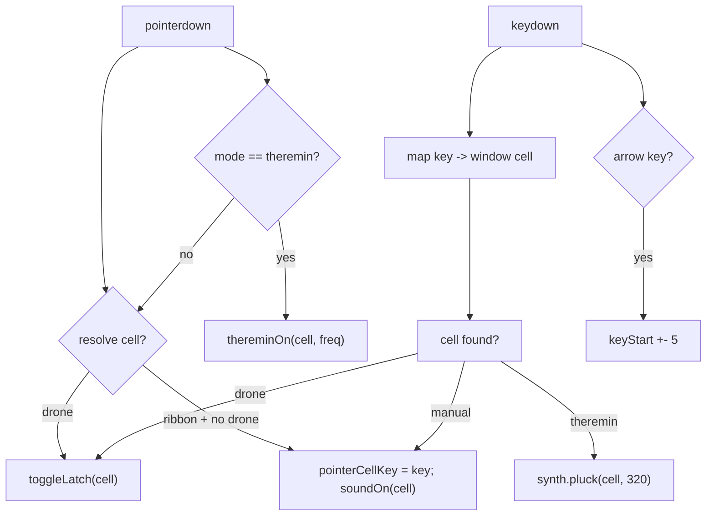

# Data Flow

This document follows one performance from physical input to screen output.

## Input events



## Controller to synth

The controller never passes React objects to the synth. It passes `Cell` and `SynthSettings`:

```ts
synth.noteOn(cell, 0.95);
synth.thereminGlide(freq, cell);
synth.updateSettings({ master: 0.7 });
```

The synth stores each voice keyed by `cell.key`:

```ts
private voices = new Map<string, Voice>();
```

`cell.key` is `"radio:Stillness"`, a value that is stable across sessions and directly derived from the data model.

## Synth to visualiser

The visualiser reads the analyser directly:

```ts
const analyser = synth.analyser;
analyser.getByteFrequencyData(freqData);
analyser.getByteTimeDomainData(timeData);
```

This creates a small coupling: the visualiser imports the synth singleton. The visualiser does not need React state for audio; it only needs `accent` and `intensity` props, which it stores in refs for the RAF loop.

## Component data path

```text
App.tsx
  └─ useInstrumentController -> InstrumentController object
  └─ passes slices to:
      Header -> mode, selectMode, accent
      Readout -> currentCell, accent, intensity
      Ribbon -> mode, drone, latched, activeKeys, keyForCell,
                handlers, ribbonRef
      ControlDeck -> settings, updateSetting, mode, drone, arp,
                     arpRate, setArpRate, accent, panic
      StartOverlay -> onStart
```

No component imports the synth except `Visualizer` and the hook. This keeps the component tree mostly presentational.

## Where data is derived

| Output | Source |
| --- | --- |
| Cell frequency | `midiToFreq(midi)` |
| Accent colour | `currentCell.band.color` or default `#8a7bff` |
| Intensity | `currentCell.index / (CELLS.length - 1)` |
| Keyboard label | `keyForCell(cell.index)` |
| Arp step duration | `90 + (1 - arpRate) * 360` ms |
| Knob readout | `Math.round(value * 100)` |

## Intentional non-persistence

The instrument does not write any state to `localStorage` or `sessionStorage`. Every session starts from the same conceptual state. This is a deliberate constraint: the work is a live performance instrument, not a stateful application.
