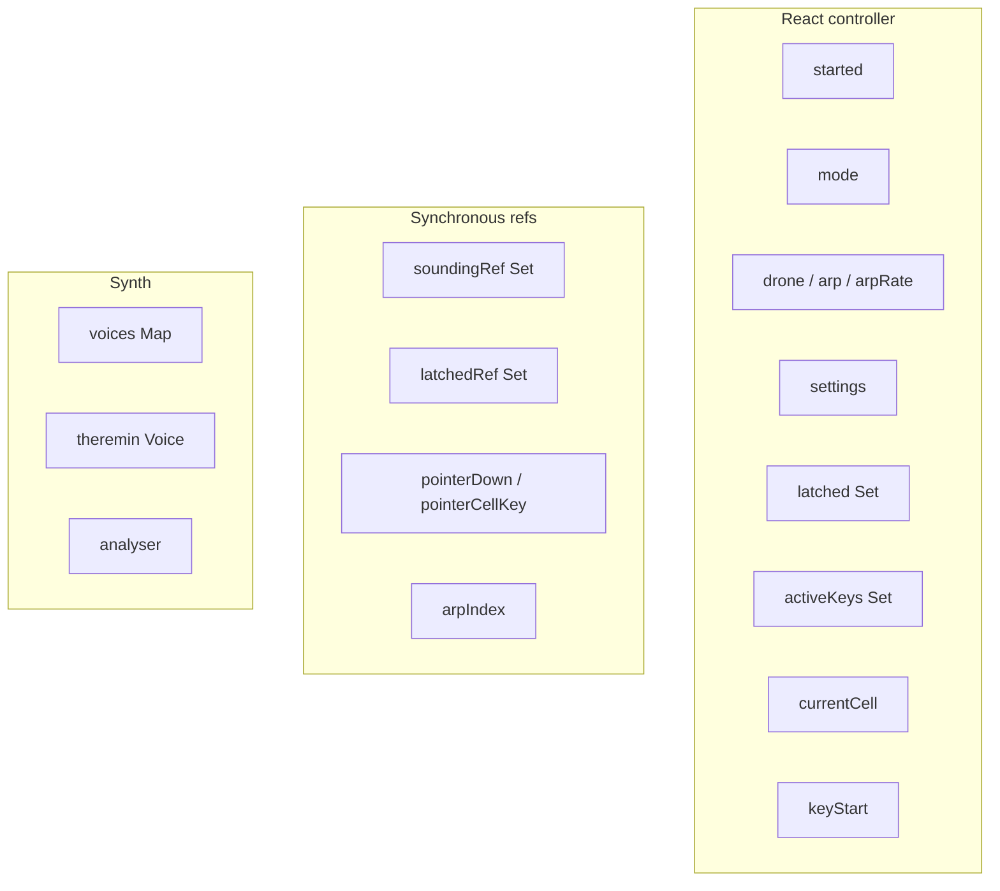

# State Model

Source: [`src/hooks/useInstrumentController.ts`](../../src/hooks/useInstrumentController.ts)

This document describes what the controller owns, what the synth owns, and where each state transition happens.

## Ownership split



React state drives presentation. Refs drive things that must be readable from inside `setInterval`, pointer events, and callback closures. The synth owns actual audio.

## State transitions

### Power On

`start()` calls `synth.ensureStarted()`, applies current settings, then sets `started = true`. This is the only path that creates an `AudioContext`.

### Ribbon note

Pointer down on a cell calls `soundOn`:

```text
if already sounding -> return
synth.noteOn(cell, 0.95)
soundingRef.add(cell.key)
setCurrentCell(cell)
setActiveKeys(new Set(soundingRef.current))
```

Pointer move checks `pointerCellKey.current`; if it changed, the previous cell is released and the new one started.

Pointer up calls `endPointer`, which releases the current pointer cell (unless drone).

### Drone latch

`toggleLatch(cell)` toggles a cell in the `latched` react state and writes the new set to `latchedRef`. It also updates `currentCell`.

A reconcile effect then:

- calls `noteOn` for every latched cell not already sounding,
- calls `noteOff` for every sounding cell removed from `latched`.

The effect is guarded by `drone && !arp && mode !== "theremin"`.

### Arpeggiator

When `arp` becomes true, a separate effect silences all currently sounding voices. The arpeggiator effect then starts a `setInterval` that:

1. reads `latchedRef.current`,
2. picks a key via `arpIndex`,
3. calls `synth.pluck(cell, ms * 0.9, 0.9)`,
4. sets `currentCell`, sets `activeKeys` to one key, then clears it after `ms * 0.7`.

All scheduled timeouts are cleared when the effect cleanup runs.

### Mode switch

`selectMode(next)` is called from the mode buttons. It is not a raw state setter: it calls `clearAllUnsafe()` (all voices off, refs cleared, `latched` and `activeKeys` reset) before setting `mode`.

This is the only transition that intentionally destroys the whole performance state.

### Panic

`panic` is `clearAllUnsafe`. It silences all synth voices and resets all controller state except `started`, `mode`, `settings`, `arpRate`, and `keyStart`.

### Keyboard

The keyboard effect maps the current twenty-cell window to `KEY_ROW`. It tracks held keys in a local `Set` to use the browser `keydown`/`keyup` pairing.

- `ArrowLeft` / `ArrowRight` shift the window by 5 cells.
- Home-row keys call either `soundOn`, `toggleLatch`, or `pluck`, depending on mode.

## Known state debt

- **Drone-off does not reconcile.** If a user turns Drone off while latched voices are sounding, the effect that would stop them is skipped. The voices keep sounding until Panic, mode switch, or the corresponding key is released. This is documented in README's Known Limitations and is a high-priority roadmap item.
- **Theremin and latched state are not integrated.** Switching to Theremin clears everything; there is no "hold into theremin" transition.
